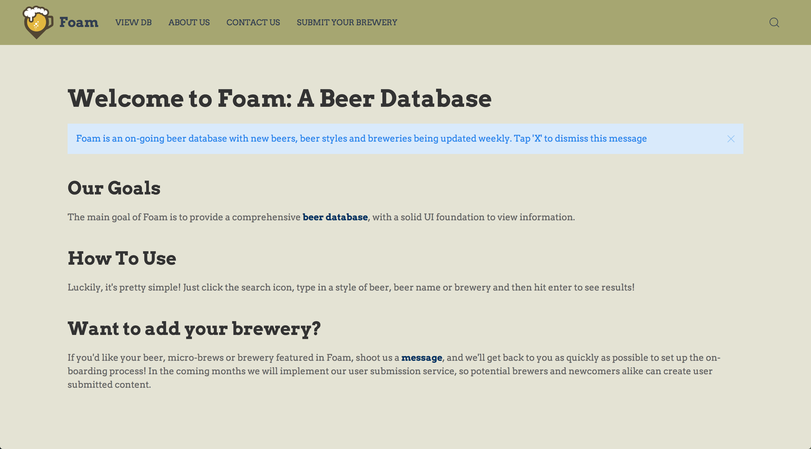

# Foam DB
Foam DB

Foam is a beer database to show thousands of beer styles, beer names and breweries for your informational needs.
## Getting Started
https://fast-plateau-59007.herokuapp.com/

## Screen Shots

Main Page

## Technologies used
Node.js
MySQL
Knex.js
Pagination.js
UI Kit
Handlebars - http://handlebarsjs.com/
body-parser NPM Package - https://www.npmjs.com/package/inquirer
express NPM Package - https://www.npmjs.com/package/express
mysql NPM Package - https://www.npmjs.com/package/mysql
handlebars NPM Package - https://www.npmjs.com/package/handlebars
express-handlbars NPM Package - https://www.npmjs.com/package/express-handlebars

## Prerequisites
- Node.js - Download the latest version of Node https://nodejs.org/en/
- UI Ki

## Built With
Atom - Text Editor
MySql Workbench - Sql editor
UI Kit - CSS Framework
Heroku - hosting
Github - hosting
